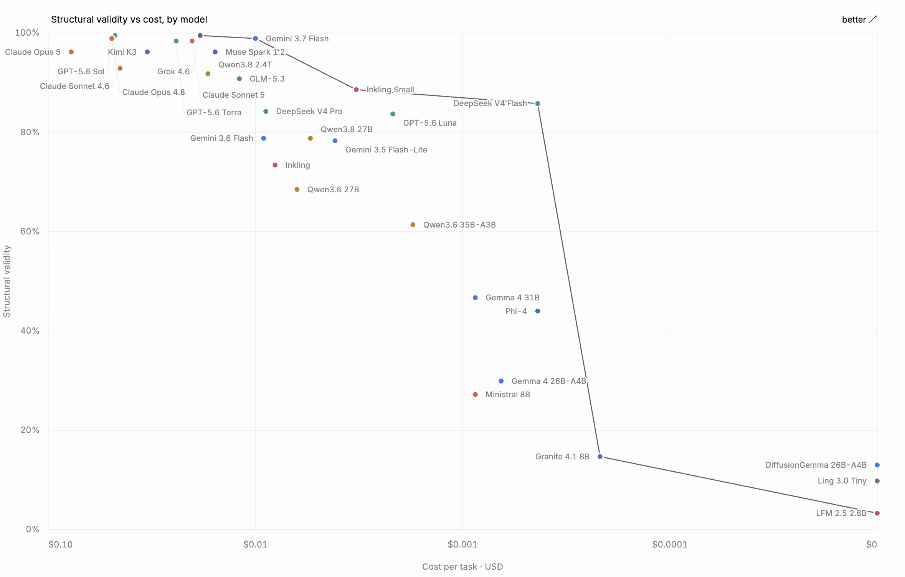

<div align="center">

# generative-ui-bench

**How reliably do today's models generate working UI?**

One catalog of 70 components, 46 screen briefs, four attempts each, and three
generative-UI formats judged by their own SDKs:
[OpenUI Lang](https://github.com/thesysdev/openui), Google
[A2UI](https://github.com/a2ui-project/a2ui) (v0.9), and Vercel
[json-render](https://github.com/vercel-labs/json-render) (0.19).

[Benchmark](https://openui.com/benchmarks) · [OpenUI](https://github.com/thesysdev/openui) · [Docs](https://openui.com)



</div>

Every raw model output and every scored verdict is committed here. Anyone can
rescore the data offline and diff against the published results, or add a new
model with one command.

## How it works

- 46 screen briefs in 5 size bands (2 to 18 numbered requirements). None
  names a component or layout.
- A 70-component catalog derived from OpenUI's public component library.
  `catalog/public-catalog.json` is the reference surface;
  `node tools/check-catalogs.ts` verifies the three protocol catalogs stay
  equivalent to it.
- One uniform condition: 4 generations per brief, temperature 0.7, reasoning
  minimal/none, 16,384-token output ceiling.
- Each format's prompt comes from its own SDK's generator, all carrying the
  same two worked examples. Each format's validation is its own SDK's shipped
  code plus one shared completeness layer, identical for all three: a run is
  complete when it parses, renders a root, every reference resolves, every
  component is reachable from root, and required and enum-typed props check
  out. A coverage floor requires at least as many components as the brief has
  numbered requirements.

## The html control arm

`html` is a fourth format, off the headline board on purpose. It has no catalog
and no SDK: models write plain HTML, and the verdict comes from parse5 (the
HTML5 reference parser jsdom ships) plus the same shared completeness layer,
with a tag-balance scan on top because the spec parser recovers from unclosed
and stray tags without reporting anything.

```bash
BENCH_MODEL=gpt-5.6-luna BENCH_LABEL=mylabel BENCH_PROVIDER=openai \
OPENAI_API_KEY=... node run.ts html          # BENCH_HTML_STYLE=tailwind for the styled condition
node score.ts mylabel
```

Read it as a floor, not as a competitor: HTML has no closed component
vocabulary, so there is almost nothing for a model to get wrong, and completion
saturates. A 5-brief probe (`BENCH_ONLY=b1-invoice,b2-sales,b3-crm,b4-bank,b5-exec`)
shows what the arm does and does not measure:

| Model | openui | json-render | html |
|---|---:|---:|---:|
| gpt-5.6-luna, 4 reps | — | — | 40/40 complete (plain and tailwind) |
| gpt-5-nano, 2 reps | 2/10 | 0/10 | 10/10 |

What the arm does measure is length: on those briefs the same model's mean
output was 876 tokens of OpenUI Lang, 1,413 as plain HTML (1.6x) and 2,796 as
Tailwind-styled HTML (3.2x). Semantic fidelity to the brief — whether the
screen a browser paints is the screen that was asked for — is not scored for
any format here, and unlike the other three, HTML has no renderer contract
that would make it scoreable.

## Results

The headline board (six models, one seat per company, all three formats) is
on the [benchmark page](https://openui.com/benchmarks).
OpenUI-only runs beyond it, same condition:

| Label | Model | Provider | Complete |
|---|---|---|---|
| `grok` | x-ai/grok-4.6 | OpenRouter | 183/184 (99.5%) |
| `gemini37` | google/gemini-3.7-flash | OpenRouter | 182/184 (98.9%) |
| `sonnet5` | claude-sonnet-5 | Anthropic | 181/184 (98.4%) |
| `opus5` | claude-opus-5 | Anthropic | 177/184 (96.2%) |
| `sonnet46` | claude-sonnet-4-6 | Anthropic | 171/184 (92.9%) |
| `oxalpha` | stealth/ox-alpha | OpenRouter | 169/184 (91.8%) |
| `glm` | z-ai/glm-5.3 | OpenRouter | 167/184 (90.8%) |
| `qwen27blow` | qwen/qwen3.8-27b, reasoning low | OpenRouter | 160/184 (87.0%) |
| `deepseekflash` | deepseek/deepseek-v4-flash-0731 | OpenRouter | 157/183 (85.8%) |
| `qwen27bmed` | qwen/qwen3.8-27b, reasoning medium | OpenRouter | 157/183 (85.8%) |
| `qwen27bhigh` | qwen/qwen3.8-27b, reasoning high | OpenRouter | 157/184 (85.3%) |
| `deepseekpro` | deepseek/deepseek-v4-pro-0813 | OpenRouter | 155/184 (84.2%) |
| `luna` | gpt-5.6-luna | OpenAI | 154/184 (83.7%) |
| `qwen27b` | qwen/qwen3.8-27b, reasoning minimal | OpenRouter | 145/184 (78.8%) |
| `flashlite` | google/gemini-3.5-flash-lite | OpenRouter | 144/184 (78.3%) |
| `lingtiny` | inclusionai/ling-3.0-tiny | local (llama.cpp) | 18/184 (9.8%) |

The four `qwen27b*` labels are one model at four reasoning efforts. All
committed results are scored under lang-core 0.2.16.

## Reproduce the scores (no API keys)

Node >= 22.18; the harness runs TypeScript directly. The openui scorer is
`@openuidev/lang-core` pinned to exactly 0.2.16; the pin is part of the
published condition.

```bash
npm install

# A2UI's scorer needs the official python SDK at the pinned revision:
python3 -m venv .venv
.venv/bin/pip install antlr4-tools
.venv/bin/pip install "a2ui-agent-sdk @ git+https://github.com/a2ui-project/a2ui@29b715fa89fc5bb8351d2ea0116f03d4f2e212f2#subdirectory=agent_sdks/python/a2ui_agent"

A2UI_PYTHON=.venv/bin/python node score.ts           # all models
A2UI_PYTHON=.venv/bin/python node score.ts gemini    # one model
```

`score.ts` rewrites `results/results-<model>.json` from the raws alone, so a
diff against the committed results is the integrity check. Without
`A2UI_PYTHON` it scores openui and json-render and leaves results files
untouched. `raw/<label>/truncated.json` records generations that hit the
output ceiling. Token and cost tables: `node tools/count-tokens.ts` and
`node tools/cost-estimate.ts`.

## Run a model yourself

```bash
BENCH_MODEL=google/gemini-3.6-flash BENCH_LABEL=gemini \
OPENROUTER_API_KEY=... node run.ts openui jsonrender a2ui
```

`BENCH_PROVIDER` selects openrouter (default), openai, anthropic, google, or
local. Raws are idempotent, so an interrupted run resumes by re-running the
same command. See the header of `run.ts` for every knob. Then
`node score.ts <label>`. New briefs follow `briefs/DESIGN.md`; a new protocol
is one folder under `protocols/` exposing a system prompt and an
`evaluate(text, {reqs})` verdict.

## Layout

| Path | What it is |
|---|---|
| `briefs/` | The 46 briefs as data and the band design. |
| `catalog/public-catalog.json` | The shared 70-component catalog. |
| `protocols/` | One folder per format: catalog, prompt, validator, each built on its own SDK. |
| `protocols/html/` | The control arm: no catalog, verdict from the HTML5 reference parser. |
| `run.ts` | Generation runner. |
| `score.ts` | Offline scorer, no API keys needed. |
| `tools/` | Catalog check, token counts, cost estimates, blank-screen floor. |
| `raw/` | Every scored model output, verbatim. |
| `results/` | Scored verdicts per model, one row per run. |

## Notes

- Empty responses score as blanks. Failed API calls are retried at
  generation time and never scored as model failures.
- The method builds on Mobile Reality's
  [MDMA benchmark](https://github.com/MobileReality/mdma). SDK versions are
  pinned by the committed `package-lock.json` and the python install command
  above. The files under `raw/` are verbatim model outputs, published as the
  benchmark's data record.
